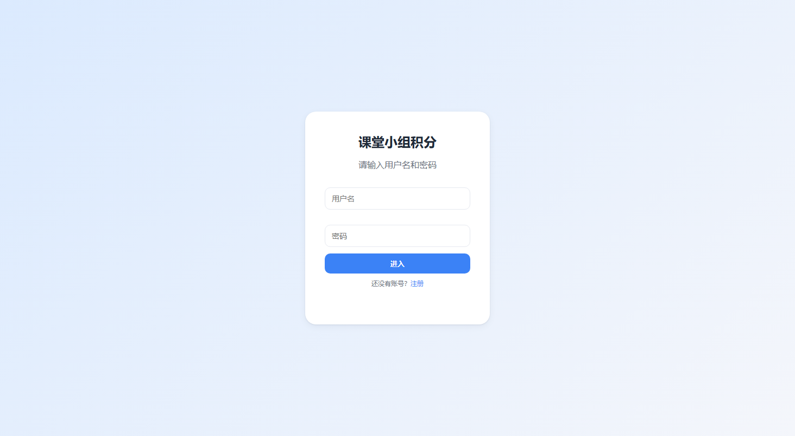
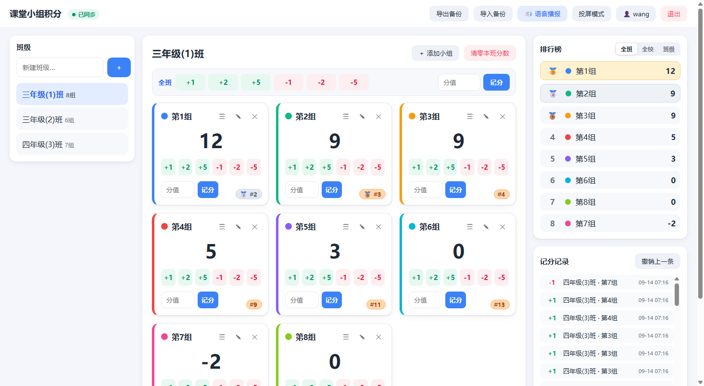
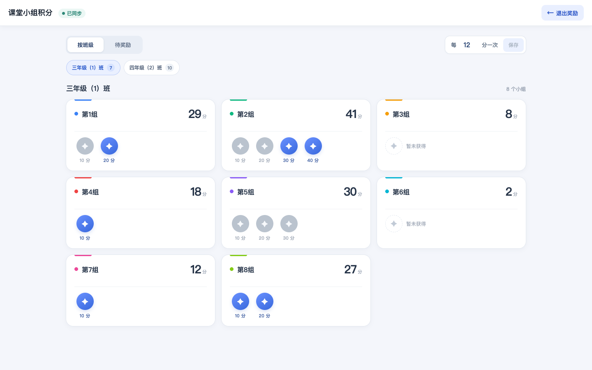
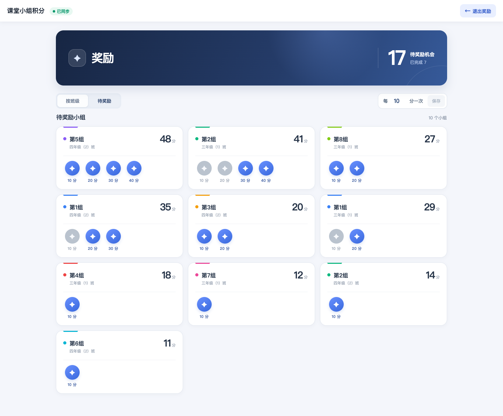
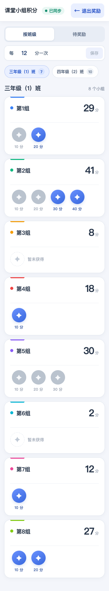
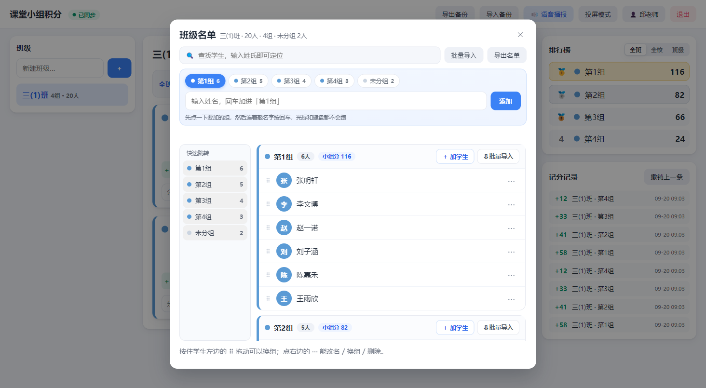
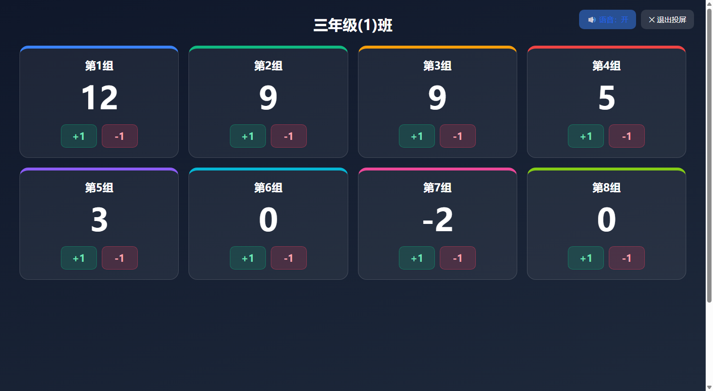
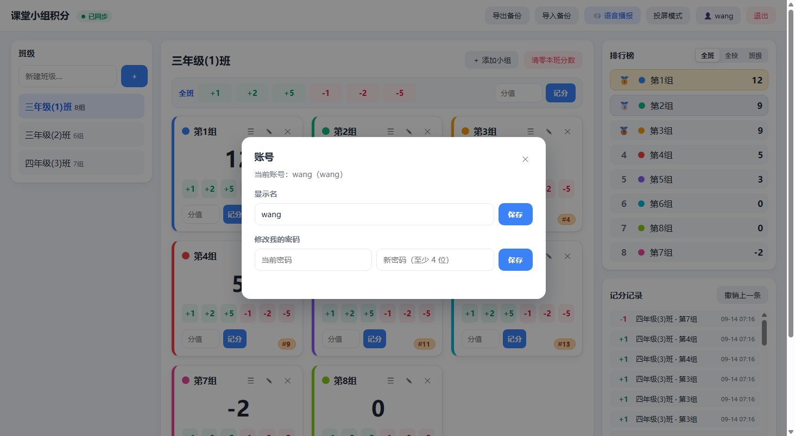
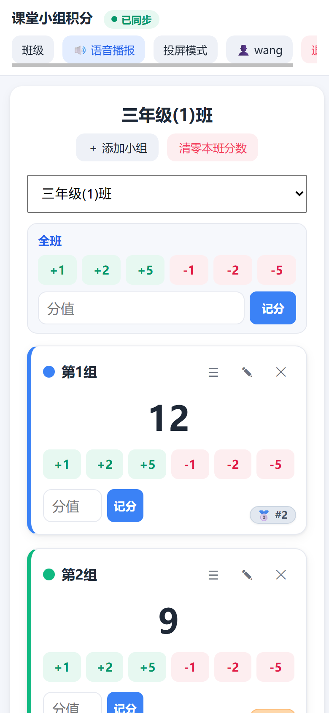
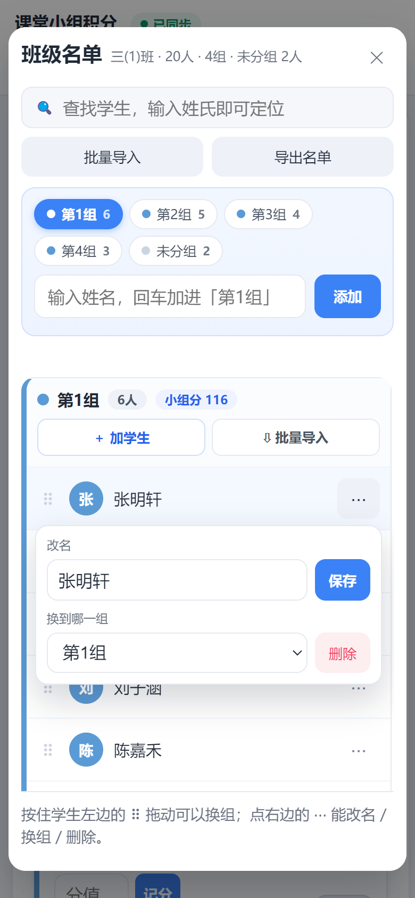

# 课堂小组积分系统

一个用于课堂上记录小组加减分的小应用。支持班级管理、小组管理、班级名单、一键加减分、实时排行榜、记分历史、撤销，以及多设备实时同步（任一设备加了分，其他设备自动更新）。

## 界面预览

（截图里用的是演示数据）

登录页（用户名 + 密码，任何老师都可以自己注册账号）



注册页


主界面：左侧班级列表、中间小组记分卡（右下角是全校排名角标）、右侧排行榜与记分记录



奖励页：按班级查看各组机会，蓝色为积分奖励、橙色为手动奖励，灰色为已完成；完成和恢复均需确认



待奖励：集中查看仍有奖励机会的小组



手机上的奖励页



班级名单：记分板上的「📋 班级名单」，每个小组一份名单，合起来就是班级名单；顶部常驻快速添加条（点一下组，之后连着敲名字回车就行）、左侧快速跳转、随时搜索，也支持批量导入到指定小组和拖动换组



投屏模式：大字展示给全班看，并且可以直接在投屏界面上 +1 / -1



账号设置：点顶栏用户名即可打开，可改显示名、改密码



移动端（顶栏收成一行，班级改为弹窗，记分卡单列）



移动端的班级名单（弹窗占满宽度，输入框和手机键盘都不收起，可以一个接一个录；右边「⋯」打开的是贴着这一行的浮层）



## 技术栈

- 后端：Python + Flask，SQLite 存储
- 前端：原生 HTML / CSS / JS 单页应用
- 实时：Server-Sent Events（SSE）
- 部署：Docker Compose + nginx 反向代理 + Cloudflare DNS-only（灰云直连，源站使用 Let's Encrypt 证书）

## 功能

- 班级管理（增删改）
- 小组管理（增删改、颜色），小组固定顺序展示，支持长按拖拽手柄调整顺序
- 班级名单：每个小组可以有一份学生名单，汇总起来就是这个班的班级名单
  - 加学生：先在顶部快速添加条点一下要加的组，然后一直敲名字按回车；一次写好几个人（用空格 / 逗号 / 顿号隔开）也行，加错了点「撤销上一个」退回
  - 找学生：顶部搜索框随时过滤，左边「快速跳转」按小组直接跳到那一段
  - 批量导入到小组：小组卡片上的「⇩ 批量导入」直接锁定这一组，名单顶部的「批量导入」先选组；面板四步（选组 → 粘贴 → 确认 → 完成）可以来回切，边粘边解析——蓝色是新进、琥珀是别组有同名、划掉的是跳过；一行可以写好几个名字（换行、逗号、顿号、分号、空格、斜杠都当分隔），写成「第3组,宋佳琪」这种带组名的行会落到那一组，小组不存在会自动新建；本组已有同名默认自动跳过，也能改成仍然导入；导完出一条结果和「撤销本次导入」，新进来的名字在名单里蓝色高亮几秒
  - 改名 / 换组 / 删除：点学生右边的「⋯」，弹出的是贴着这一行的小浮层，不会把下面的名单顶走
  - 拖动换组：按住学生左边的拖动柄，可以直接把他拖到别的小组，顺序自动保存
  - 导出名单：按「小组,姓名」两列导出 CSV，Excel / WPS 直接打开
  - 名单跟着账号隔离，也一起进学期备份（导出 / 导入）
  - 名单不跟着分数刷新：加减分只更新那一张卡片和名单里的「小组分」小标签，名单本身不会被重建；加人 / 改名 / 换组也只改动动过的那一行
- 一键加减分：`+1 +2 +5 -1 -2 -5`，也可自定义分值
- 全班加减分：给本班每个小组同时加/减同一个分值（记分板顶部「全班」一行，同样支持 `+1 +2 +5 -1 -2 -5` 和自定义分值；记分记录合并为一条「全班 · N组」，撤销时整批回退）
- 撤销上一条误操作（若上一条是全班加减分，则整批一起撤销）
- 奖励机会：顶栏「奖励」进入，可按班级查看全部小组，或按班级、小组固定顺序汇总待奖励小组；每达到一个可设置的积分档位，首次发放一个机会。扣分、清零或调低分数后再涨分不会重复发放；也可以给指定小组手动增加带备注的机会。完成和恢复都需确认，多设备实时同步
- 奖励档位按账号设置。更改档位后，从各组历史最高分之后开始计算；积分机会、手动机会及完成状态会随学期备份导出、导入
- 即时反馈：点击加减分后本地立刻更新分数，再后台提交，不等待网络往返
- 增量实时同步：其他设备的改动通过 SSE 直接推送变更内容，前端只更新变化的小组，不整页重新拉取
- 实时排行榜（含投屏模式，大字投给全班）
- 排行榜三种视角：**全班**（当前班的小组）、**全校**（自己名下所有班级的小组混排）、**班级**（以班级为单位，班级分 = 全班小组积分之和）
- 记分历史记录（每条都标明是哪个班、哪个组的改动）
- 数据导出 / 导入（学期备份）
- 账号体系：用户名 + 密码登录，任何人都能自助注册；每个账号的班级、小组、分数、记录**完全独立**，互相看不到也改不了
- 语音播报：加分念「第X组加X分」，扣分念「第X组扣X分」，全班加减分念「全班加/扣X分」；每次加减分立刻播报，可按设备开关（默认开启）
- 清零本班分数需输入**自己的登录密码**确认
- 移动端适配：响应式布局、触控优化、输入框防页面缩放、投屏可滚动
- 移动端「班级」弹窗：点击顶栏按钮弹出班级管理窗口，桌面端仍是侧栏

## 本地运行（不需要 Docker）

```bash
pip install -r requirements.txt
python application/app.py
```

然后浏览器打开 `http://localhost:5000`。

第一次启动会自动创建一个账号，密码取环境变量 `ADMIN_PASSWORD`（默认 `jiafen123`），用户名取 `FIRST_USER`（默认 `Qiuzizhao`）；登录后点顶栏用户名即可改密码。其他老师打开登录页点「注册」就能自己开账号。

可以设置这些环境变量：

```bash
set ADMIN_PASSWORD=第一个账号的初始密码
set FIRST_USER=第一个账号的用户名
set SECRET_KEY=一长串随机字符
set REGISTER_PER_IP_LIMIT=30
python application/app.py
```

`REGISTER_PER_IP_LIMIT` 是注册防刷限制（同一 IP 每小时最多注册几个账号，默认 30，设成 `0` 表示不限制）。

数据保存在 `application/data/jiafen.db`，删除该文件即清空数据。想在别处放数据库（比如本地拿一份线上数据来试）可以设 `JIAFEN_DB_PATH` 指向另一个 `.db` 文件。

## 移动端体验

手机浏览器（建议横屏或竖屏均可）会自动切换为移动端布局：

- **顶部操作栏**：只显示「奖励 / 班级 / 语音播报 / 投屏模式 / 账号」，隐藏桌面端的「备份」菜单；进入奖励页后顶栏按钮变为「退出奖励」。
- **班级管理**：点击顶栏「班级」按钮，从顶部弹出班级管理窗口（新建班级、切换班级、改名/删除），点遮罩或 ✕ 关闭；桌面端仍是左侧边栏。
- **切换班级**：记分板上方有下拉框，可直接切换班级，无需打开弹窗。
- **输入防缩放**：移动端所有输入框字号 ≥ 16px，聚焦输入时不会触发 iOS 整页放大。
- **触控优化**：按钮、拖拽手柄、快速加减分都加大触控目标，去掉了点按延迟。
- **移动计分**：小组卡片每行两张，只显示 `+1 / -1`；「全班」保留 `+1 / +2 / +5 / -1 / -2 / -5`。小组排序、编辑、删除及自定义分值在桌面端使用。
- **投屏模式**：手机上可上下滚动查看全部小组，卡片自动改双列布局。

## 部署到云服务器（nginx 反向代理 + Cloudflare 灰云直连）

前提：一台有公网 IP 的云服务器 + 一个在 Cloudflare 管理的域名；服务器安装 Docker，主机上安装 Nginx。云服务器安全组及防火墙需开放 TCP 80 和 443；应用仅绑定本机 `127.0.0.1:5002`。

### 第 1 步：服务器装 Docker

Ubuntu / Debian：

```bash
curl -fsSL https://get.docker.com | sh
```

### 第 2 步：上传项目 + 配置

把本项目上传到服务器（如 `/srv/jiafen`），然后：

```bash
cp .env.example .env
```

编辑 `.env`，填好：

- `ADMIN_PASSWORD`：第一个账号的初始密码（首次启动时用它创建账号，之后改密码在网页里改）
- `FIRST_USER`：第一个账号的用户名，默认 `Qiuzizhao`
- `SECRET_KEY`：一长串随机字符（可用 `openssl rand -hex 32` 生成）
- `REGISTER_PER_IP_LIMIT`（可选）：同一 IP 每小时最多注册几个账号，默认 30，`0` 表示不限制

### 第 3 步：启动应用

```bash
cd /srv/jiafen && docker compose up -d --build
```

应用会映射到服务器的 `127.0.0.1:5002`（只本机可访问，供 nginx 反代）。

### 第 4 步：先配置 nginx HTTP 反代

先在 `/etc/nginx/sites-enabled/jiafen` 配置 HTTP 反代，让 Certbot 能通过 80 端口完成域名验证（将 `jiafen.qiuzizhao.com` 换成实际域名）：

```nginx
server {
    listen 80;
    server_name jiafen.qiuzizhao.com;
    client_max_body_size 20m;
    location / {
        proxy_pass http://127.0.0.1:5002;
        proxy_http_version 1.1;
        proxy_set_header Host $host;
        proxy_set_header X-Real-IP $remote_addr;
        proxy_set_header X-Forwarded-For $proxy_add_x_forwarded_for;
        proxy_set_header X-Forwarded-Proto $scheme;
        proxy_buffering off;
        proxy_cache off;
        proxy_connect_timeout 15s;
        proxy_send_timeout 300s;
        proxy_read_timeout 300s;
    }
}
```

```bash
sudo nginx -t && sudo systemctl reload nginx
```

> `proxy_buffering off` 很关键：否则 Server-Sent Events 实时推送会被缓冲。

### 第 5 步：申请源站 HTTPS 证书

使用公开可信的 Let's Encrypt 证书。Cloudflare 橙云可以先保持开启；DNS 记录的源站目标必须指向这台服务器，且外网可通过 HTTP 到达 80 端口。

```bash
sudo apt update
sudo apt install certbot python3-certbot-nginx
sudo certbot certonly --nginx -d jiafen.qiuzizhao.com
```

申请成功后，证书路径为：

```text
/etc/letsencrypt/live/jiafen.qiuzizhao.com/fullchain.pem
/etc/letsencrypt/live/jiafen.qiuzizhao.com/privkey.pem
```

### 第 6 步：配置 HTTPS 并强制跳转

在同一 Nginx 配置中，将 80 端口改为跳转 HTTPS，并添加 443 端口反代：

```nginx
server {
    listen 80;
    server_name jiafen.qiuzizhao.com;
    return 301 https://$host$request_uri;
}

server {
    listen 443 ssl;
    server_name jiafen.qiuzizhao.com;
    client_max_body_size 20m;

    ssl_certificate     /etc/letsencrypt/live/jiafen.qiuzizhao.com/fullchain.pem;
    ssl_certificate_key /etc/letsencrypt/live/jiafen.qiuzizhao.com/privkey.pem;

    location / {
        proxy_pass http://127.0.0.1:5002;
        proxy_http_version 1.1;
        proxy_set_header Host $host;
        proxy_set_header X-Real-IP $remote_addr;
        proxy_set_header X-Forwarded-For $proxy_add_x_forwarded_for;
        proxy_set_header X-Forwarded-Proto https;
        proxy_buffering off;
        proxy_cache off;
        proxy_connect_timeout 15s;
        proxy_send_timeout 300s;
        proxy_read_timeout 300s;
    }
}
```

```bash
sudo nginx -t && sudo systemctl reload nginx
sudo certbot renew --dry-run
```

Certbot 会安排自动续期；HTTP 80 端口需要保持公网可访问，以便完成后续续期验证。

### 第 7 步：Cloudflare DNS

在 Cloudflare 将 JiaFen 子域名的 **A 记录**指向服务器公网 IP，并设为 **DNS only（灰云）**。灰云请求会绕过 Cloudflare，浏览器直接连接源站的 443 端口；源站必须提供匹配域名的公开可信证书。Cloudflare 的 Flexible / Full 模式不参与这条直连请求，因此这里不需要调整区域级 SSL/TLS 模式。灰云会公开源站 IP，且请求不经过 Cloudflare 的代理防护。

如果以后要把 JiaFen 切回橙云，先为该主机名使用 **Full (strict)**，再开启代理。由于 HTTP 端口会跳转 HTTPS，使用 Flexible 回源会形成重定向循环；若同一区域还有其他橙云网站，应先确认它们的源站也支持 HTTPS，避免直接修改影响全区域的默认模式。

浏览器和 App 均使用 `https://jiafen.qiuzizhao.com/`。

## 常用命令

```bash
# 查看状态
docker compose ps
# 查看日志
docker compose logs -f app
# 停止
docker compose down
# 更新后重新构建并启动
docker compose up -d --build
```

## 数据备份

- 桌面端点击「备份 → 导出备份」可下载 JSON 文件，也可从同一菜单导入备份。
- 也可直接拷贝服务器上的 `application/data/jiafen.db` 文件。

## 注意事项

- 实时同步依赖 Server-Sent Events，因此请保持应用为**单进程**运行（默认即是）。
- 每个打开的页面/设备会占用 1 条 SSE 长连接，服务端线程池为 64（`application/app.py` 中 `threads=64`），因此大约支持 60 个页面同时在线；如果以后设备更多，调大这个数值即可。
- 前端采用「先本地生效、再后台提交」的乐观更新：点击即时响应，提交失败会回滚并提示；切回页面或窗口重新聚焦时若超过 20 秒没同步，会自动对账一次。
- 每个账号只能看到、只能修改自己名下的班级，「全校」排行榜和卡片上的全校排名角标也只统计自己名下的班级。
- 注册是开放的（任何人都能在登录页自助开号），只做了一层防刷限制；如果不希望陌生人开号，可以把 `REGISTER_PER_IP_LIMIT` 调小，或者自行在 nginx / Cloudflare 上加访问限制。
- 登录失败有限速：同一 IP + 用户名 15 分钟内错 5 次会锁 5 分钟。
- 多设备用同一个账号登录，即可共享同一份数据、实时同步。
- 前端资源和首页已禁用缓存（`no-cache, no-store`），并带资源版本号；手机/浏览器如仍显示旧界面，可强制刷新（Ctrl+F5）。
- 「备份」菜单只在桌面端显示，移动端请在桌面端或电脑浏览器操作。
